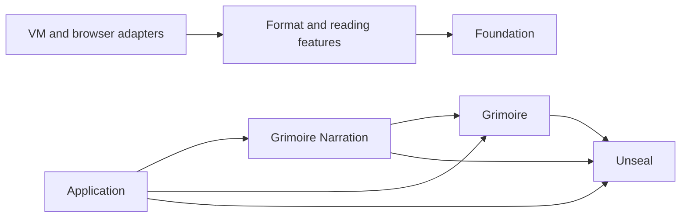

# Unseal architecture

This document explains the durable boundaries in Unseal. It is a map for
maintainers. It does not inventory every file or repeat generated scan output.

## Scope

Unseal accepts book bytes or a filesystem path and returns a common `Book`
model. The model contains metadata, resources, reading order, navigation,
covers, and statistics. Format-specific book types preserve details that do
not fit the common model.

Unseal owns parsing and reading data. It does not own:

- reader widgets or web views, which belong to Grimoire;
- media playback or text-to-speech, which belong to Grimoire Narration;
- downloads, authentication, library storage, or synchronization, which
  belong to consuming applications.

The library stays pure Dart. The example may use Flutter, but `lib/` may not.

## Dependency direction

Unseal never imports either downstream package. Inside Unseal, features may
depend on `foundation`. Foundation types and policies must not depend on a
specific format.

## Public API

`lib/unseal.dart` is the default entry point. It exports the `Unseal` facade,
the common book model, reading services, typed exceptions, and stable
format-specific contracts.

Files such as `lib/epub.dart`, `lib/pdf.dart`, and `lib/comic.dart` are narrow
entry points for consumers that need one format. Public signatures must use
types exported by the same public entry point. Consumers must not import
`lib/src/`.

The main operations are:

- `Unseal.read` and `Unseal.readMetadata` for portable asynchronous reads;
- `Unseal.parse` and `Unseal.readMetadataSync` for synchronous formats;
- `Unseal.readFile` and `Unseal.readMetadataFile` on filesystem platforms;
- `UnsealWorker` for optional browser-worker execution.

CB7 and CBC remain asynchronous because their 7-Zip reader is asynchronous.

## Building blocks

| Area | Paths | Responsibility |
| --- | --- | --- |
| Common model | `lib/src/foundation/entities/` | Books, files, resources, navigation, metadata, and statistics shared by formats. |
| Shared safety and decoding | `lib/src/foundation/archive/`, `images/`, `text/` | Archive access, path normalization, image inspection, plain text, and XML decoding. |
| Detection and dispatch | `lib/src/features/detection/`, `reading/`, `lib/src/platform/unseal_reader.dart` | Detect the format, refine ambiguous MOBI input, select the parser, and normalize public errors. |
| Format features | `lib/src/features/<format>/` | Parse one container or document family and build the common model. |
| Reading services | `lib/src/features/search/`, `locators/`, `cfi/`, `annotations/`, `opds/` | Search, portable locations, EPUB CFI, annotation serialization, and OPDS parsing. |
| Platform execution | `lib/src/platform/io/`, `web/`, `web/unseal_worker.dart` | Filesystem reads, isolate work, browser workers, and structured-clone wire codecs. |
| Heuristics | `lib/src/heuristics/` | Small format-neutral text and chapter heuristics. |

Keep a helper with the feature that owns its decision. Move code to
`foundation` only when separate features share the same stable rule.

## Read flow

1. A public facade receives bytes, an optional password, and read options.
2. Format detection checks bounded signatures and container structure.
3. Dispatch selects one format parser.
4. The parser validates its container before expanding or traversing data.
5. The parser builds a common `Book` model and, when needed, a subtype such as
   `EpubBook`, `ComicBook`, or `PdfBook`.
6. The facade normalizes format and implementation errors into public typed
   exceptions.

Metadata-only reads follow the same detection and safety boundaries but avoid
materializing content that the metadata path does not need.

## Browser-worker flow

`UnsealWorker.configure` records the worker URL. A later asynchronous read can
send bytes and operation data to `web/unseal_worker.dart`. The worker parses
the book and sends a versioned, structured-clone-safe representation back.

If the worker cannot start, Unseal uses the browser's main thread. This keeps
the API available, but a large parse can block the UI. Wire changes must stay
backward-consistent within one release and require Chrome tests.

## Safety boundaries

Input is untrusted. The following rules are architectural, not parser details:

- Normalize archive paths before lookup or extraction.
- Reject encrypted entries, symbolic links, unsupported compression methods,
  excessive expansion, and oversized output before materialization.
- Bound PDF objects, page trees, content streams, and image decoding.
- Bound XML depth and convert malformed or excessive structures to typed
  failures.
- Preserve HTML as data. A consuming renderer must sanitize or isolate it.
- Reject unsupported DRM. Do not attempt to bypass access controls.

Format-specific limits may differ because the formats have different cost
models. The public README records the user-visible limits and exclusions.

## Testing strategy

- Unit tests cover codecs, metadata, models, and narrow parser decisions.
- Format tests cover valid files, corrupt input, security limits, and typed
  failures.
- Public-contract tests ensure entry points compile without private imports.
- Chrome tests cover conditional imports, worker behavior, and web codecs.
- Deterministic fuzz tests exercise hostile structures with reproducible
  seeds and process-level deadlines.
- Benchmarks measure detection, metadata reads, full parsing, and selected
  hot paths. They are evidence, not release gates by themselves.

Fixtures under `test/resources/` are part of the test contract. Preserve their
bytes and provenance unless the change intentionally updates the fixture.

## Decisions and known limits

- Pure Dart portability takes priority over platform-native parsers.
- One common reading model takes priority over reproducing every source
  application's layout model.
- PDF support targets reading and extraction. It is not a full PDF renderer.
- DOCX and ODT conversion preserves semantic reading structure, not exact page
  layout.
- HTML remains unsanitized so parsing does not silently rewrite content.
- Optional damaged metadata or navigation may be skipped when readable content
  remains, but structural corruption and safety-limit violations must fail.

Record a separate architecture decision when a change reverses one of these
choices or introduces a new cross-package dependency.

## Keeping this document current

Update this file when a public entry point, dependency direction, building
block responsibility, critical runtime flow, or safety boundary changes. Do
not add file counts, scan results, temporary paths, release status, or a list
of every class. Those facts become stale faster than the architecture.
