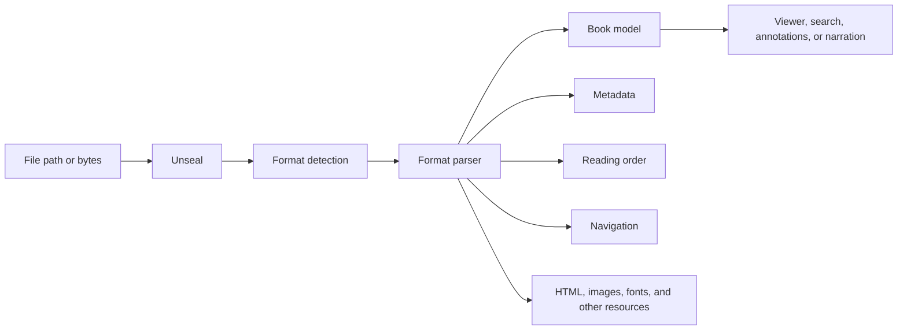

# Understand the unseal codebase

This guide explains how unseal turns book files into one model that reading applications can use. It is for developers who know Dart but do not yet know the details of EPUB, MOBI, PDF, office documents, or comic archives.

The guide follows the code in this repository. It explains each feature, the reason behind its internal layers, and the job of every Dart file under `lib/`.

Use it in two ways:

1. Read "The whole library in one picture" before reviewing any feature.
2. Open a feature section and read its files in table order. The first files show the public result and orchestration. The later files contain format details.

This document describes unseal itself. unseal Viewer owns interactive rendering. unseal Viewer Narration owns speech and audio playback. Neither concern belongs in a format parser here.

Paths that start with `features/`, `foundation/`, or `platform/` are relative to `lib/src/`. Paths that start with `lib/` or `web/` are relative to the repository root.

## Find the part you need

| If you want to understand... | Read... |
| --- | --- |
| The common book model and shared policies | Foundation, then Detection and Reading |
| Reflowable text and document formats | TXT, HTML, DOCX, ODT, FB2, then EPUB |
| Image-first or binary formats | CBZ/CBR, CB7/CBC, MOBI/AZW3, AZW4, then PDF |
| Positions and reader-facing capabilities | Search, Locators, Annotations, CFI, and Reading progression |
| Catalogs that point to books | OPDS and Calibre |
| Native isolates, browser workers, and serialization | Platform |

## The whole library in one picture

Most calls follow this path:



The input is a sequence of bytes. Detection identifies the family of the file. Dispatch chooses one parser. The parser translates its format into `Book`, `BookMetadata`, `Files`, `Navigation`, and `ReadingOrderItem`.

That translation is the central job of unseal. Consumers do not need one reading interface for EPUB and another for DOCX. They receive the same concepts even though the source formats store them in very different ways.

### The common result

Every parsed publication is a `Book`:

- `format` says which source format produced the book.
- `metadata` contains the title, authors, language, series, cover, and other catalog information.
- `files` groups extracted HTML, CSS, images, fonts, and other resources.
- `navigation` is the table of contents in a common tree structure.
- `readingOrder` lists the content in the order in which a reader opens it.
- `archiveEntries` records the physical files inside formats that preserve an archive inventory. TXTZ, HTMLZ, DOCX, ODT, and EPUB populate it; not every format backed by an archive does.
- `statistics` derives word count and reading-time estimates from the extracted text.

`DocumentBook` is the common concrete result for formats that unseal converts into HTML: TXT/TXTZ, HTML/HTMLZ, DOCX, and ODT. FB2, EPUB, MOBI, comics, and PDF retain specialized book types because consumers need additional information from those formats.

## Vocabulary used throughout the code

You only need a small set of format terms to understand most of the repository.

| Term | Meaning in this project |
| --- | --- |
| Bytes | The raw numbers read from a file before unseal knows what they represent. |
| Format detection | Inspection of signatures and bounded content to identify a file family. A file extension alone is not trusted. |
| Container | A file that stores other files or records. ZIP, RAR, 7-Zip, and Palm Database are containers. PDF instead stores a connected graph of objects and streams. |
| Package | A container plus rules that say which internal files matter and how they relate. EPUB, DOCX, and ODT are ZIP packages. |
| Package part | One named file inside a package, such as `word/document.xml`. A part can describe content or relationships; a resource is content the finished publication exposes; a ZIP entry is merely the physical container member. |
| Parser | Code that reads source structures and turns them into Dart values. |
| Codec | Code that encodes, decodes, compresses, or decompresses bytes. A codec does not decide the reading order. |
| XML and namespace | XML is a tree-shaped text format. A namespace qualifies element names so vocabularies such as Dublin Core and OpenDocument can coexist without name collisions. |
| DOM | An in-memory tree of a parsed HTML or XML document. Parsers navigate elements, attributes, and text nodes through it. |
| BOM and text encoding | A byte-order mark can identify how bytes represent Unicode text. When no BOM exists, a format may provide an encoding declaration or require a defined fallback. |
| Base64 | A way to represent binary bytes as text. FB2 uses it to place images inside XML. |
| Metadata | Descriptive information such as title, author, language, publisher, and cover. |
| Resource | Content used by the publication, such as an image, font, stylesheet, or audio file. |
| Media type or MIME type | A standardized content label such as `image/jpeg` or `application/xhtml+xml`. It is more precise than a filename extension. `BookFile.type`, despite its name, normally stores the extension without the leading dot. |
| Manifest | A format-owned list of resources. EPUB uses an OPF manifest to give each resource an identifier and media type. |
| OPF | The EPUB package document. It holds metadata, the manifest, the spine, and related package declarations. TXTZ and HTMLZ may use an OPF file only as a metadata sidecar; that does not make them EPUBs. |
| Spine | EPUB's ordered list of manifest item identifiers that make up the main reading sequence. Manifest order, spine order, and table-of-contents order can differ. |
| NCX | The older XML table-of-contents format normally used by EPUB 2 and also represented in some Kindle data. |
| SMIL | An XML timing format. A `seq` groups items in sequence; a `par` synchronizes text and audio in parallel. unseal parses timing, while another package plays the audio. |
| Sidecar | A neighboring file that adds information to the main book without being stored inside it, such as `metadata.opf`. |
| WordprocessingML | The XML vocabulary used by DOCX for paragraphs, runs, styles, numbering, and document relationships. |
| DOCX relationship | A mapping in a `.rels` part from an identifier in document XML to another package part or an external URL. |
| ODF or OpenDocument | The package and XML standard used by ODT. It is separate from Microsoft's DOCX vocabulary. |
| Glyph and CID | A glyph is the shape a font draws. In a composite PDF font, a CID identifies a glyph, but a separate Unicode mapping is usually needed to recover the intended character. |
| PDF content stream | A small program of drawing operators that places text, images, and graphics on a page. It is not stored as paragraphs. |
| PDF XObject | A reusable image or form referenced by a content stream. The current extractor follows image XObjects but does not enter form XObjects. |
| Predictor | A reversible row transformation applied before compression. PDF decoding reverses it after Flate or LZW decompression. |
| Crypt filter | A PDF rule that selects the cipher used for a particular stream or string. |
| Huffman, arithmetic, and MMR coding | Three compact binary representations used by the supported compression formats. Their decoders turn code bits and probability states back into symbols, numbers, or black-and-white rows. |
| Reading order | The sequence of chapters or pages. In EPUB this comes from the spine. In comics it comes from sorted image names. |
| Navigation | A hierarchy of named destinations, usually shown as a table of contents. |
| Reflow | Conversion of fixed or loosely positioned content into text and blocks that adapt to the screen width. |
| Facsimile view | Display of the original PDF pages with their original geometry. The Viewer can use the bytes retained by `PdfBook` for this mode. |
| Fixed layout | Content whose original page geometry matters. PDF and most comics are fixed-layout formats. |
| OCR | Recognition of characters inside an image. unseal does not perform OCR, so an image-only scan has no searchable text unless the PDF already contains a text layer. |
| Locator | A portable description of a reading position. It is separate from the viewer's temporary scroll state. |
| CFI | EPUB Canonical Fragment Identifier, a standard path to a position inside an EPUB document. |
| DRM | Access control that requires authorization or a key the library does not own. unseal reports unsupported DRM instead of pretending that the file is corrupt. |

## Supported publication formats

| Format | What it contains | What unseal produces |
| --- | --- | --- |
| EPUB 2 and EPUB 3 | A ZIP package with metadata, HTML chapters, resources, and navigation. | `EpubBook` with its package model, reading spine, resources, navigation, and links to optional SMIL media overlays. Consumers parse those SMIL files separately. |
| MOBI 6 | A Palm Database container with compressed legacy Kindle markup. | `MobiBook` with reconstructed HTML, resources, metadata, and navigation. |
| AZW3 or KF8 | A newer Kindle representation, sometimes stored beside MOBI 6 in one file. | `MobiBook` tagged as `BookFormat.azw3`. |
| AZW4 | A Palm Database wrapper whose payload is a PDF. | `PdfBook` tagged as `BookFormat.azw4`. |
| PDF | A graph of numbered objects that describes pages, fonts, drawing commands, images, and metadata. | `PdfBook` with original bytes, page geometry, extracted text, images, outline, and reflowed HTML. |
| TXT | Plain text with no formal book structure. | One HTML document, filename or header metadata, and a single navigation point. Markdown and Textile headings are recognized only when that input mode is selected. |
| TXTZ | A ZIP archive containing text documents and optional metadata or cover files. | `DocumentBook` with the ordered text documents converted to HTML and their extracted resources. |
| HTML | One HTML document. | A `DocumentBook` that preserves the decoded source HTML while normalizing its path and deriving metadata and heading navigation. |
| HTMLZ | A ZIP archive with a top-level HTML file and optional OPF metadata. | `DocumentBook` with the HTML entry point and its resources. |
| DOCX | A ZIP package of WordprocessingML XML parts. | Reflowable HTML, extracted resources, metadata, and navigation. |
| ODT | A ZIP package defined by the OpenDocument format. | Reflowable HTML, extracted resources, metadata, and navigation. |
| FB2 and zipped FB2, often called FBZ | FictionBook XML with text structure and embedded Base64 resources. | `Fb2Book` with generated HTML sections, resources, metadata, and navigation. The ZIP inventory itself is not retained. |
| CBZ | A ZIP of comic page images, sometimes with `ComicInfo.xml`. | `ComicBook` with ordered image pages and optional comic metadata. |
| CBR | A RAR archive of comic page images. | The same `ComicBook` model as CBZ. |
| CB7 | A 7-Zip archive of comic page images. | The same `ComicBook` model, opened asynchronously. |
| CBC | A ZIP collection that lists nested comics in `comics.txt`. | One flattened `ComicBook` whose pages follow collection order. |

The detector explicitly rejects Amazon Topaz, Amazon KFX, and RTF. An encrypted PDF can open when the caller supplies a supported password. Kindle DRM and unsupported PDF security handlers fail with an owned exception.

## Start with the public API

The files at the root of `lib/` define what package consumers can import. They do not implement parsing.

| File | What it exposes |
| --- | --- |
| `lib/unseal.dart` | The main format-neutral API. It exports every supported parser family, shared book types, detection, reading helpers, search, annotations, locators, CFI, OPDS, Calibre, text policies, and reader facades. |
| `lib/epub.dart` | EPUB parsing, EPUB entities, metadata updates, media-overlay structure, and shared book entities. |
| `lib/mobi.dart` | MOBI and AZW3 parsing, MOBI entities and exceptions, and shared book entities. |
| `lib/azw4.dart` | AZW4 extraction and parsing plus the `PdfBook` result type. |
| `lib/pdf.dart` | PDF parsing, PDF entities and exceptions, and shared book entities. |
| `lib/docx.dart` | DOCX parsing and DOCX exceptions. |
| `lib/odt.dart` | ODT parsing and ODT exceptions. |
| `lib/fb2.dart` | FB2 parsing, FB2 entities and exceptions. |
| `lib/html.dart` | HTML and HTMLZ parsing through the small public wrapper in the HTML feature. |
| `lib/txt.dart` | TXT and TXTZ parsing and metadata reading. It deliberately hides archive-level helpers. |
| `lib/comic.dart` | CBZ and CBR parsing, comic entities and exceptions. |
| `lib/comic7.dart` | CB7 and CBC parsing while reusing the common `ComicBook` model. |

Read `lib/unseal.dart` first when reviewing public compatibility. An item exported there becomes part of the normal consumer contract. A file under `lib/src/` stays internal unless an entry point exports it.

## Foundation: the language shared by all formats

`lib/src/foundation/` contains values and policies used by multiple independent features. It does not contain a half-finished format parser. A format-specific rule stays with its format even when the implementation is large.

### Book and file entities

| File | What it does and why it exists |
| --- | --- |
| `foundation/entities/book/book.dart` | Defines the base `Book` contract and derives statistics and a default reading order from extracted HTML. Every parser returns a subtype of this contract. |
| `foundation/entities/book/document_book.dart` | Holds the common result of formats converted to HTML. It adds an optional cover, archive inventory, and explicit order without making each document format invent a book class. |
| `foundation/entities/book/reading_order_item.dart` | Names one item in reading order and records whether it is HTML. Comics use non-HTML items. |
| `foundation/entities/book/files.dart` | Groups images, CSS, HTML, fonts, and remaining binaries so consumers do not inspect format-owned containers. |
| `foundation/entities/book/archive_entry.dart` | Records a physical archive member's path and size without keeping its expanded bytes. This supports inventory and diagnostics. |
| `foundation/entities/file/book_file.dart` | Defines the shared identity of an extracted file: name, extension-like type, and path. The `type` value is normally `jpg`, `xhtml`, or `css`, not a MIME type. |
| `foundation/entities/file/text_file.dart` | Stores text content and exposes markup-free, whitespace-collapsed plain text. Parsers use it for HTML and CSS. |
| `foundation/entities/file/binary_file.dart` | Stores byte content for images, fonts, and other binary resources. |
| `foundation/entities/navigation/navigation.dart` | Defines the common table-of-contents root. |
| `foundation/entities/navigation/nav_point.dart` | Defines one table-of-contents node, including its label, target, ordering, and children. |
| `foundation/entities/book_metadata.dart` | Defines the format-neutral metadata record and computed sort keys. Every parser maps native metadata into this type. |
| `foundation/entities/book_cover.dart` | Stores cover bytes and the detected `ImageType`; the filename extension and MIME type are derived from that image format. |
| `foundation/entities/book_format.dart` | Lists the concrete source formats represented after parsing. |
| `foundation/entities/book_statistics.dart` | Computes word count and estimated reading time from each HTML file's collapsed `plainText` once per book. Stable character positions use a different text view. |
| `foundation/entities/entities.dart` | Re-exports the foundation entity files as one internal and public convenience entry point. |

### Shared policies

| File | What it does and why it exists |
| --- | --- |
| `foundation/archive/archive_access.dart` | Normalizes archive paths, resolves relative references, finds entries case-insensitively where appropriate, and converts archive content to bytes. It keeps ZIP path quirks out of each parser. |
| `foundation/files/book_file_factory.dart` | Creates `BinaryFile` and `TextFile` values with consistent names, paths, and inferred types. |
| `foundation/images/cover_helpers.dart` | Selects a fallback image cover and converts a `BinaryFile` into `BookCover`. |
| `foundation/images/image_dimensions.dart` | Reads dimensions from supported image headers without decoding a full bitmap. |
| `foundation/images/image_type_sniffer.dart` | Identifies common image formats from their bytes. Comic and document parsers use it instead of trusting file extensions. |
| `foundation/language/rtl_languages.dart` | Identifies right-to-left language codes for reading-direction decisions. |
| `foundation/metadata/book_metadata_operations.dart` | Merges metadata sources and applies a filename fallback. It centralizes precedence when a sidecar and the book disagree. |
| `foundation/metadata/series_index.dart` | Parses plain numeric series positions such as `2`, `2.5`, or `0,5` after trimming and decimal-separator normalization. Decorated values such as `Volume 2` are not accepted. |
| `foundation/metadata/sort_keys.dart` | Builds stable author sorting values and removes bracketed qualifiers when the policy requires it. |
| `foundation/metadata/title_sort.dart` | Moves leading articles according to language so titles sort consistently. |
| `foundation/text/canonical_document_text.dart` | Scans and memoizes HTML into the whitespace-preserving character stream used by search, progression, navigation, locators, and annotations. This file defines where text offsets mean the same thing across capabilities. |
| `foundation/text/html_escape.dart` | Escapes text before parsers insert it into generated HTML. |
| `foundation/text/plain_text.dart` | Removes tags, scripts, styles, and comments from HTML, decodes entities, and collapses whitespace into readable plain text. |
| `foundation/text/plain_text_writer.dart` | Implements the stateful whitespace and block-boundary rules used by plain-text extraction. |
| `foundation/text/word_count.dart` | Counts words in normalized text for statistics. |
| `foundation/text/xml_encoding.dart` | Detects BOMs and XML encoding declarations, then decodes XML bytes. This is necessary because FB2, OPF, and office XML are not always UTF-8. |
| `foundation/text/xml_encoding_tables.dart` | Holds the single-byte character tables used by `xml_encoding.dart`. Data stays separate from decoding control flow. |
| `foundation/exceptions/unseal_exception.dart` | Defines package-wide errors for unsupported formats, invalid books, and DRM-protected input. Format modules add more specific subclasses. |

`lib/src/heuristics.dart` is a separate package-wide policy file. It improves weak source documents by guessing chapter headings, normalizing scene breaks, straightening hard-wrapped lines, and replacing plain punctuation. These are opt-in reading heuristics, not format detection.

### Two text views with different jobs

`TextFile.plainText` removes markup and collapses whitespace. `Book.statistics` uses that text because word count does not need stable DOM offsets.

`documentTextOf` preserves the visible character space inside the document body. Search, progression, navigation anchors, CFI, locators, and annotations use that text because a character offset must keep the same meaning across those capabilities.

Do not replace one operation with the other because their output looks similar in a small example. The difference is part of the position contract.

## Detection: identify the family before parsing

Detection answers "what kind of bytes are these?" It does not construct a book. ZIP needs a second step because the same container can hold EPUB, DOCX, ODT, FB2, HTMLZ, TXTZ, CBZ, or CBC.

The flow is:

`bytes -> detectFormat -> DetectedFormat -> BookDispatch -> concrete BookFormat`

For ZIP, `BookDispatch` checks internal evidence in order: EPUB, CBC, FB2, DOCX, ODT, HTMLZ, TXTZ, then image-based CBZ. The order prevents a generic ZIP fallback from stealing a package with stronger identifying files.

| File | What it does and why it exists |
| --- | --- |
| `features/detection/entities/detected_format.dart` | Defines broad families recognized from bytes. These values are intentionally less specific than `BookFormat` when deeper inspection is required. |
| `features/detection/detect_format.dart` | Checks signatures and bounded content for PDF, ZIP, 7-Zip, RAR, Palm Database, FB2, HTML, and text. It also rejects known unsupported families with clear errors. |
| `features/detection/refine_mobi_format.dart` | Opens enough of a Palm Database header to distinguish legacy MOBI from KF8 or AZW3 after broad detection. |

## Reading: select a parser and resolve reading positions

| File | What it does and why it exists |
| --- | --- |
| `features/reading/book_dispatch.dart` | Owns the central mapping from detected families to parsers. It also opens ZIP once and distinguishes EPUB, FB2, DOCX, ODT, HTMLZ, TXTZ, CBC, and CBZ by internal evidence. |
| `features/reading/book_progression.dart` | Calculates section and whole-book fractions from a section and character position. It lets consumers express progress without knowing each format's storage. |
| `features/reading/nav_resolution.dart` | Resolves `NavPoint.content` strings into typed targets aligned with a book's reading order. It handles paths, fragments, MOBI `filepos` targets, and malformed or missing destinations. It does not resolve comic or PDF page numbers. |

`BookDispatch` is intentionally central. Without it, every reader facade would duplicate a growing series of format checks. The individual parsers remain independent and do not choose one another, except where one format truly wraps another, such as AZW4 wrapping PDF.

### Why several parser folders use Dart `part` files

TXT, DOCX, ODT, and FB2 split their implementation with Dart's `part` and `part of` directives. In each case, `parse_<format>_book.dart` is the library. The part files are not independently importable modules, and their private names remain visible to one another because Dart compiles them as one library.

The folders still matter: they let a reader find package access, metadata, rendering, and resources without scrolling through one very large file. They are reading boundaries inside one implementation, not runtime interfaces.

## TXT and TXTZ: create structure from plain text

TXT has no formal metadata, resource manifest, or table of contents. unseal must decode the bytes, apply bounded conventions, and produce one safe HTML document. TXTZ adds a ZIP container around that text and may include metadata or a cover.

The flow is:

`bytes -> decode text -> read optional header -> render paragraphs and headings -> DocumentBook`

| File | What it does and why it exists |
| --- | --- |
| `features/txt/parse_txt_book.dart` | Coordinates TXT and TXTZ parsing, encoding fallback, size limits, metadata conventions, ordered documents, covers, resources, navigation, and final `DocumentBook` construction. |
| `features/txt/text/txt_document.dart` | Turns plain text, a limited Markdown subset, or a limited Textile subset into safe HTML and derives navigation from headings. Rendering rules stay separate from archive selection. |
| `features/txt/archive/txtz_archive.dart` | Validates archive limits and paths, orders text entries naturally, reads optional metadata, and returns the validated archive contents. `parse_txt_book.dart` later classifies resources. |

Plain TXT becomes paragraphs with one navigation point. Headings are recognized only when the caller explicitly selects the supported Markdown or Textile input mode. The separate, opt-in policies in `lib/src/heuristics.dart` are not applied by `parseTxtBook`.

## HTML and HTMLZ: preserve an existing document

Standalone HTML already contains document structure. HTMLZ packages a top-level HTML file and its assets in ZIP. Some HTMLZ books also include an OPF file with richer metadata.

The flow is:

`HTML bytes or HTMLZ archive -> decode DOM -> normalize paths and inspect headings -> collect metadata/resources -> DocumentBook`

| File | What it does and why it exists |
| --- | --- |
| `features/html/html.dart` | Re-exports the HTML exception and parsing operations as the feature's internal barrel. |
| `features/html/parse_html_book.dart` | Coordinates standalone HTML and HTMLZ, chooses the archive entry point, merges HTML and OPF metadata, extracts resources, and builds `DocumentBook`. |
| `features/html/parsing/html_document.dart` | Decodes the HTML document, preserves that decoded HTML in a `TextFile`, normalizes its file path, and derives navigation from heading elements. It does not sanitize or rewrite the DOM. |
| `features/html/metadata/html_metadata.dart` | Reads title, authors, description, language, identifiers, and cover hints from HTML and optional OPF structures. |
| `features/html/exceptions/html_exception.dart` | Reports HTMLZ failures such as an invalid ZIP, a missing root HTML entry, or an empty selected entry. Standalone HTML parsing is intentionally tolerant. |

## DOCX: translate WordprocessingML into HTML

A DOCX file is a ZIP package. Its main document, styles, numbering, relationships, metadata, fonts, and images live in separate XML parts. Relationship identifiers connect document elements to resources.

The flow is:

`ZIP -> required DOCX parts -> relationships/styles/numbering -> XHTML -> resources -> DocumentBook`

| File | What it does and why it exists |
| --- | --- |
| `features/docx/parse_docx_book.dart` | Coordinates the package reader, metadata, relationships, styles, numbering, renderer, resources, cover fallback, and final `DocumentBook`. |
| `features/docx/container/docx_package.dart` | Validates the ZIP as DOCX and locates required and optional XML parts. It hides package paths from the rest of the feature. |
| `features/docx/container/docx_relationships.dart` | Maps Word relationship identifiers to normalized targets such as images and hyperlinks. |
| `features/docx/metadata/docx_metadata.dart` | Reads the core-properties XML into `BookMetadata`. |
| `features/docx/styles/docx_styles.dart` | Interprets named styles and numbering definitions used while rendering paragraphs and lists. |
| `features/docx/rendering/docx_renderer.dart` | Walks WordprocessingML and emits XHTML plus navigation. It handles paragraphs, runs, headings, lists, tables, external links, images, breaks, and basic inline formatting. Footnotes and endnotes are not implemented. |
| `features/docx/resources/docx_resources.dart` | Extracts referenced images, fonts, and remaining package files into `Files`. The first extracted image becomes the cover fallback, which can be a logo rather than a true cover. |
| `features/docx/exceptions/docx_exception.dart` | Defines DOCX errors for invalid packages, missing parts, and malformed XML. |
| `features/docx/exceptions/exceptions.dart` | Re-exports the public DOCX exception types. |

DOCX separates relationships and rendering because an image element does not contain an image path. It contains an identifier that only the relationships part can resolve.

## ODT: translate OpenDocument XML into HTML

An ODT file is also a ZIP package, but its XML vocabulary differs from DOCX. `content.xml` stores the document, `styles.xml` stores reusable styles, and `meta.xml` stores metadata.

The flow is:

`ZIP -> ODT package -> style catalog -> XHTML -> resources -> DocumentBook`

| File | What it does and why it exists |
| --- | --- |
| `features/odt/parse_odt_book.dart` | Coordinates metadata, styles, rendering, resources, cover selection, and final `DocumentBook`. |
| `features/odt/container/odt_package.dart` | Validates the package and provides access to the archive plus parsed `content.xml`, `styles.xml`, and `meta.xml`. It does not interpret `META-INF/manifest.xml`. |
| `features/odt/metadata/odt_metadata.dart` | Reads Dublin Core and OpenDocument metadata into `BookMetadata`. |
| `features/odt/styles/odt_styles.dart` | Resolves named and automatic styles into the properties needed by the renderer. |
| `features/odt/rendering/odt_renderer.dart` | Converts OpenDocument paragraphs, headings, lists, tables, spans, links, and images into XHTML and navigation. |
| `features/odt/resources/odt_resources.dart` | Extracts images, fonts, and other files from the package. The first extracted image becomes the cover fallback, so an early logo can be selected instead of a title-page image. |
| `features/odt/exceptions/odt_exception.dart` | Defines ODT errors for invalid packages, missing parts, and malformed XML. |
| `features/odt/exceptions/exceptions.dart` | Re-exports the public ODT exception types. |

DOCX and ODT use similar folder names because both need package access, styles, resources, metadata, and rendering. They do not share their XML interpretation because the formats define different rules.

## FB2 and FB2.zip: turn semantic XML into reading documents

FictionBook 2 stores the book as XML. Unlike DOCX, its elements describe book concepts such as sections, epigraphs, poems, and authors. Binary images can appear inside the XML as Base64 text. FB2.zip wraps an FB2 file in ZIP without changing the document model.

The flow is:

`XML bytes or ZIP entry -> decoded FB2 document -> embedded resources and metadata -> section XHTML -> Fb2Book`

| File | What it does and why it exists |
| --- | --- |
| `features/fb2/parse_fb2_book.dart` | Coordinates byte or archive input, XML parsing, resources, metadata, body conversion, and `Fb2Book` construction. |
| `features/fb2/container/fb2_document.dart` | Decodes the source XML, validates the FictionBook root, and exposes the root and body elements. Metadata code finds the description from that root. |
| `features/fb2/metadata/fb2_metadata.dart` | Maps FB2 title information, authors, language, genres, sequence, identifiers, dates, publisher data, and cover reference into `BookMetadata`. |
| `features/fb2/resources/fb2_resources.dart` | Decodes embedded Base64 binaries, classifies images, and resolves the cover. |
| `features/fb2/rendering/fb2_html_renderer.dart` | Converts FB2 bodies and semantic elements into HTML files, CSS, and navigation. |
| `features/fb2/entities/fb2_book.dart` | Defines the specialized book result for FB2 content. |
| `features/fb2/entities/entities.dart` | Re-exports the public FB2 entity types. |
| `features/fb2/exceptions/fb2_exception.dart` | Defines feature-owned FB2 parsing failures. |
| `features/fb2/exceptions/exceptions.dart` | Re-exports the public FB2 exception types. |

## EPUB: assemble a publication from a package

An EPUB is a ZIP package. `META-INF/container.xml` points to an OPF package document. The OPF lists resources in a manifest and lists reading order in a spine. EPUB 2 often stores navigation in NCX. EPUB 3 normally stores it in an HTML navigation document. Optional SMIL files synchronize text with prerecorded audio.

The flow is:

`ZIP -> root OPF path -> package model -> manifest files -> spine order -> navigation/cover/encryption -> EpubBook`

### Package and book model

| File | What it does and why it exists |
| --- | --- |
| `features/epub/parse_epub_book.dart` | Coordinates the complete EPUB parse. It locates and parses the OPF, reads navigation and encryption metadata, extracts files, finds the cover, calculates spine paths, and builds `EpubBook`. |
| `features/epub/epub_document.dart` | Defines the EPUB-specific document contract used by `EpubBook`, including its package and spine paths. |
| `features/epub/entities/book/book.dart` | Implements `EpubBook` with the common `Book` values plus the parsed package, explicit spine, and archive inventory. |
| `features/epub/entities/entities.dart` | Re-exports the public EPUB entity files. |
| `features/epub/container/epub_root_file.dart` | Reads `container.xml` to find the OPF path and provides a recovery scan for real books with missing or broken container metadata. |
| `features/epub/package/parse_epub_package.dart` | Parses OPF XML into an EPUB 2 or EPUB 3 package model, including metadata, manifest, spine, guide, and refinements. |
| `features/epub/entities/package/epub_package.dart` | Defines the shared package data: metadata, manifest items, spine references, and guide references. |
| `features/epub/entities/package/epub_2_package.dart` | Stores EPUB 2 metadata and adapts its older OPF rules to the shared package interface. |
| `features/epub/entities/package/epub_3_package.dart` | Stores EPUB 3 metadata and refinements under the shared package interface. |
| `features/epub/entities/package/page_progression_direction.dart` | Represents left-to-right, right-to-left, and `unspecified` page progression. A missing, invalid, or OPF `default` value becomes `unspecified`. |

### Content, metadata, and navigation

| File | What it does and why it exists |
| --- | --- |
| `features/epub/content/epub_files.dart` | Resolves manifest paths, decodes text, classifies resources, and undoes declared IDPF or Adobe obfuscation only for font resources. Unknown encryption algorithms make the EPUB unsupported. |
| `features/epub/metadata/epub_metadata.dart` | Maps the version-specific package metadata and optional cover into `BookMetadata`. |
| `features/epub/metadata/epub_cover.dart` | Applies EPUB 2 and EPUB 3 cover conventions, resolves the chosen manifest item, and reads its image bytes. |
| `features/epub/metadata/epub_metadata_writer.dart` | Updates selected metadata fields inside an existing EPUB and writes a new ZIP while preserving unrelated entries. |
| `features/epub/navigation/epub_navigation.dart` | Converts NCX or EPUB 3 navigation HTML into common `Navigation` values. It first tries the spine's declared `toc` candidate, commonly NCX, then the EPUB 3 nav document and other candidates. |
| `features/epub/codec/epub_xml.dart` | Uses the EPUB-specific decoder for UTF-8 or UTF-16, rejects UTF-32, and parses the result into XML nodes. It does not use the broader foundation XML decoder. |

### Encryption and media overlays

| File | What it does and why it exists |
| --- | --- |
| `features/epub/encryption/epub_encryption.dart` | Reads `META-INF/encryption.xml`, handles supported font obfuscation, and distinguishes obfuscation from unsupported DRM. |
| `features/epub/media_overlays/media_overlay.dart` | Defines timed text and audio segments parsed from SMIL. It describes synchronization but does not play audio. |
| `features/epub/media_overlays/parse_media_overlay.dart` | Parses SMIL sequences, parallel text/audio nodes, clip times, and relative resource references into `MediaOverlayDocument`. |
| `features/epub/exceptions/epub_exception.dart` | Defines EPUB failures with archive and package context. |
| `features/epub/exceptions/empty_bytes_exception.dart` | Gives `EpubBook.fromBytes` a clear empty-input failure. `BookDispatch` performs its own empty check; the lower-level `parseEpubBook` function calls the ZIP decoder directly. |
| `features/epub/exceptions/exceptions.dart` | Re-exports the public EPUB exception types. |

The package model preserves manifest, spine, guide, and EPUB metadata that do not fit in `BookMetadata`. File extraction, navigation, cover selection, and encryption can therefore share one interpretation of the OPF. `updateEpubMetadata` is a separate writer that reopens the ZIP and edits OPF XML directly. Media-overlay links stay in the package model, while `parseMediaOverlay` interprets an individual SMIL document. The narration package owns playback.

## Why metadata-only APIs are separate

Catalog screens often need a title and cover without paying the full cost of rendering every chapter. The metadata paths deliberately do less work, but they still perform enough validation to avoid describing unrelated bytes as a book:

| Format | What metadata-only reading actually does |
| --- | --- |
| TXT | Reads at most the first 64 KiB for the supported header convention and filename fallback. |
| TXTZ | Opens and validates the ZIP, then inspects OPF metadata or the first text document without rendering every document. |
| HTML | Decodes the standalone document and inspects its DOM. |
| HTMLZ | Selects the root HTML and optional OPF and may load a cover, but does not classify every resource. |
| DOCX | Requires valid `word/document.xml` before accepting metadata from `docProps/core.xml`. |
| ODT | Requires valid `content.xml` before using optional `meta.xml`. |
| FB2 | Tries a bounded fast path over `<description>` and the referenced cover `<binary>`, then falls back to the complete DOM when that slice is not trustworthy. |
| EPUB | Reads the OPF and, at most, the cover rather than inflating all publication resources. |

These paths may look like partial duplicates of full parsing, but they have a different cost contract. Removing one can make a library listing parse entire books merely to show metadata.

## Required content and optional degradation

Not every malformed optional file should make the whole publication unreadable. Each feature draws that boundary differently:

| Format | Fatal condition | Optional degradation |
| --- | --- | --- |
| TXTZ | No text document, unsafe path, or archive limit violation. | Invalid OPF metadata is ignored. |
| HTMLZ | No usable root HTML document. | Invalid OPF metadata is ignored. |
| DOCX | Missing or invalid `word/document.xml`. | Missing or invalid relationships, styles, numbering, or core properties are ignored. |
| ODT | Missing or invalid `content.xml`. | Invalid `meta.xml` or `styles.xml` is ignored. |
| FB2 | Wrong root element or no body. | An invalid Base64 binary is skipped individually. |
| EPUB | No valid OPF or an unknown encryption algorithm. | Missing or broken navigation becomes an empty `Navigation`. |

## CBZ and CBR: read a comic as ordered images

CBZ and CBR use archive formats as envelopes for page images. CBZ uses ZIP. CBR uses RAR. `ComicInfo.xml` can provide a small set of descriptive metadata. Page order comes from filenames, and the first sorted image becomes the cover.

The flow is:

`ZIP or RAR -> entries -> ComicInfo.xml and image pages -> natural filename order -> ComicBook`

| File | What it does and why it exists |
| --- | --- |
| `features/comic/parse_comic_book.dart` | Detects ZIP versus RAR, reads entries, parses `ComicInfo.xml`, keeps image files, sorts pages, and builds the common `ComicBook`. |
| `features/comic/natural_page_sort.dart` | Compares page names so numeric runs sort as readers expect, such as page 2 before page 10. |
| `features/comic/entities/comic_book.dart` | Defines the fixed-layout comic result, its image files, page reading order, metadata, and first-page cover. Its structured navigation is empty because comic archives rarely declare chapters. |
| `features/comic/entities/entities.dart` | Re-exports the public comic entity types. |
| `features/comic/metadata/comic_info.dart` | Reads the supported ComicInfo fields: title, series, number, writer, genre, tags, language, publisher, and summary. It does not control page order or cover choice. |
| `features/comic/archive/rar_reader.dart` | Reads RAR headers and stored entries, then delegates compressed RAR 4 data to the owned decoder. |
| `features/comic/archive/rar4_decoder.dart` | Implements the bit, Huffman, distance, and copy state machines needed for supported RAR 2.9 and 3.x compression. |
| `features/comic/exceptions/comic_exception.dart` | Reports invalid archives, unsupported RAR methods, and missing image pages. |
| `features/comic/exceptions/exceptions.dart` | Re-exports the public comic exception types. |

The RAR decoder is long because it implements a compression algorithm. Splitting tables and tightly coupled state into arbitrary small files would make the algorithm harder to follow. The useful boundary is between archive framing, decompression, metadata, ordering, and book construction.

Current CBR support is deliberately narrower than "any RAR." Stored RAR4 and RAR5 entries work. Common non-solid RAR4 method-29 compression works. Solid archives, split entries, password protection, PPMd, RAR virtual-machine filters, and compressed RAR5 entries do not.

Comic page sniffing currently recognizes JPEG, PNG, GIF, BMP, and WebP bytes. RAR CRC values are not validated, and non-ASCII RAR filenames may decode incorrectly. Natural sorting compares basenames first when pages sit at different folder depths, then uses full paths as a tiebreaker.

## CB7 and CBC: add 7-Zip comics and collections

CB7 stores comic pages in a 7-Zip archive. Opening 7-Zip is asynchronous in the selected dependency, so the normal synchronous parser cannot handle it. CBC is a ZIP collection. Its `comics.txt` file names nested comic archives and their optional titles.

The flow is:

`CB7 -> asynchronous 7-Zip reader -> ordered pages -> ComicBook`

`CBC -> comics.txt -> nested CBZ/CBR/CB7 books -> flattened pages -> ComicBook`

| File | What it does and why it exists |
| --- | --- |
| `features/comic7/parse_comic7_book.dart` | Opens and closes 7-Zip archives, reads CB7 pages and metadata, parses CBC listings, delegates nested comics to the matching parser, and combines their pages. |
| `features/comic7/exceptions/comic7_exception.dart` | Defines errors for unreadable 7-Zip input, missing CB7 pages, and invalid CBC collections. |
| `features/comic7/exceptions/exceptions.dart` | Re-exports the public CB7 and CBC exception types. |

CB7 reuses `ComicBook` because the reading result is still an ordered image sequence. It does not reuse the private ZIP or RAR implementation because 7-Zip has a different resource and lifetime model.

CBC flattens its children into one page list and does not preserve a chapter for each nested comic. A listing entry absent from the outer ZIP is skipped. A child that is present but cannot be parsed fails the collection. CB7 also caps each extracted entry at 128 MiB.

## MOBI and AZW3: rebuild a book from Palm Database records

MOBI is a family of binary formats used by older Kindle software. The outer file is a Palm Database, or PDB, split into numbered records. Record zero contains MOBI and EXTH headers. Later records contain compressed text, indexes, images, fonts, and other resources.

EXTH is an optional collection of numbered metadata records attached to the MOBI header. INDX, TAGX, and CNCX structures relate Kindle byte positions and records to tagged data and shared strings. Record trailers are bookkeeping bytes appended to compressed text chunks; the parser removes them before joining the chunks.

Legacy MOBI 6 stores HTML-like markup with `filepos` links, where the value is a byte position in the original markup rather than a file path. KF8, commonly named AZW3, stores XHTML skeleton templates and byte-range fragments that must be reassembled. Flow zero holds the main XHTML data; later flows commonly hold CSS or SVG. Some Kindle files contain both MOBI 6 and KF8. unseal chooses the KF8 half when it is present.

The flow is:

`PDB records -> MOBI/EXTH headers -> DRM check -> choose MOBI 6 or KF8 -> decompress text -> rebuild markup/resources/navigation -> MobiBook`

### Entry point and binary headers

| File | What it does and why it exists |
| --- | --- |
| `features/mobi/parse_mobi_book.dart` | Coordinates the entire format family. It parses headers, rejects DRM, finds standalone or joint KF8 layouts, chooses the MOBI 6 or KF8 reader, and builds metadata and `MobiBook`. |
| `features/mobi/entities/mobi_book.dart` | Defines the MOBI result, chapter representation, resources, navigation, and reading order. |
| `features/mobi/entities/entities.dart` | Re-exports the public MOBI entity types. |
| `features/mobi/header/pdb_header.dart` | Parses the Palm Database header and record table and provides bounded access to numbered records. |
| `features/mobi/header/mobi_header.dart` | Parses PalmDOC and MOBI header fields that control compression, encoding, record counts, resources, indexes, and format version. |
| `features/mobi/header/exth_header.dart` | Parses optional EXTH metadata records used by Kindle for authors, identifiers, covers, KF8 boundaries, and other fields. |
| `features/mobi/codec/mobi_text_codec.dart` | Decodes MOBI text with the format's character encodings. |
| `features/mobi/codec/mobi_byte_search.dart` | Finds ASCII markers and byte patterns without mixing search logic into parsers. |
| `features/mobi/codec/mobi_bit_operations.dart` | Provides the small checked bit and integer operations shared by binary readers. |
| `features/mobi/codec/mobi_base32.dart` | Decodes the base-32 values used by MOBI structures. |

### Compression, indexes, and text

| File | What it does and why it exists |
| --- | --- |
| `features/mobi/compression/palmdoc.dart` | Decompresses the PalmDOC scheme used by many MOBI text records. |
| `features/mobi/compression/huff_cdic.dart` | Decodes MOBI's HUFF/CDIC dictionary compression with bit and phrase expansion logic. |
| `features/mobi/index/indx_reader.dart` | Reads Kindle INDX structures, tag tables, variable-width integers, and CNCX string tables into usable index maps. |
| `features/mobi/index/ncx_reader.dart` | Converts the Kindle NCX index into common navigation entries. |
| `features/mobi/reader/mobi_container.dart` | Decodes KF8 `CONT` and `CRES` image-container records, recognizes image metadata, removes the container prefix, and validates the remaining image bytes. |
| `features/mobi/reader/mobi_text.dart` | Reads text records, removes record trailers, applies the chosen decompressor, and concatenates the logical text stream. |
| `features/mobi/reader/mobi_trailing_data.dart` | Removes variable trailing entries and multibyte overlap bytes described by MOBI record flags. |

### MOBI 6 and KF8 reconstruction

| File | What it does and why it exists |
| --- | --- |
| `features/mobi/reader/mobi6_markup.dart` | Repairs legacy markup, adds anchors for file-position links, extracts image resources, and derives basic navigation when needed. |
| `features/mobi/reader/mobi8_reader.dart` | Coordinates the KF8-specific indexes, text, structure, markup assembly, resources, fonts, and navigation. |
| `features/mobi/reader/mobi8_structure.dart` | Reads FDST, skeleton, fragment, and location indexes; inserts fragments into templates; resolves Kindle positions and IDs; translates page breaks; and maps NCX positions to rebuilt parts. |
| `features/mobi/reader/mobi8_markup.dart` | Receives rebuilt parts, classifies secondary flows as CSS or SVG, rewrites `kindle:flow` and `kindle:embed` references, normalizes markup, and packages the resulting HTML, resources, cover, and navigation. |
| `features/mobi/reader/mobi8_resources.dart` | Extracts images and fonts and builds the one-based Kindle embed-index map used while rewriting markup. |
| `features/mobi/reader/mobi_font.dart` | Decodes embedded Kindle font records, including supported obfuscation and compression. |
| `features/mobi/metadata/mobi_metadata.dart` | Maps MOBI and EXTH values, cover resources, and detected version into `BookMetadata`. |
| `features/mobi/metadata/mobi_language.dart` | Maps MOBI numeric language codes to language tags used by common metadata. |
| `features/mobi/exceptions/mobi_exception.dart` | Reports invalid PDB/MOBI structures, unsupported compression, malformed indexes, and related format failures. |
| `features/mobi/exceptions/exceptions.dart` | Re-exports the public MOBI exception types. |

MOBI support has intentional limits. The parser rejects DRM and unknown compression methods. Text decoding concentrates on UTF-8 and Windows-1252. MOBI 6 navigation chooses the longest useful sequence of `filepos` links when no useful NCX exists. KF8 reconstruction uses pattern-based markup rewriting rather than a complete DOM transformation; OTH and DATP information is not fully used, and ORDT handling is an approximate printable-character projection. Audio, video, and several control-record families are ignored. A font that cannot be decoded may remain as raw `.dat` bytes.

The metadata-only path does not call the full DRM rejection used when opening content. It can read descriptive header values from a protected envelope without claiming that unseal can open the book.

## AZW4: extract a PDF before parsing it

AZW4 is not another HTML-based Kindle format. It is a Palm Database wrapper around a PDF payload, with enough Kindle metadata to label the document.

The flow is:

`PDB container -> locate PDF records -> join PDF bytes -> PDF parser -> PdfBook tagged as AZW4`

| File | What it does and why it exists |
| --- | --- |
| `features/azw4/parse_azw4_book.dart` | Extracts the payload, delegates all PDF interpretation to `parsePdfBook`, applies AZW4 format and title metadata, and returns `PdfBook`. |
| `features/azw4/container/azw4_pdf_extractor.dart` | Validates PalmDB/MOBI structure when present, rejects wrapper DRM, prefers rebuilding the payload from records, and uses a bounded search for a complete `%PDF` through `%%EOF` range as recovery. It returns embedded PDF bytes plus the container title. |
| `features/azw4/exceptions/azw4_exception.dart` | Distinguishes invalid containers, missing PDF payloads, and DRM-protected AZW4 files. |

This is intentional reuse. AZW4 owns extraction because only AZW4 knows the wrapper. PDF owns pages, fonts, security, text, images, and reflow.

The outer input is capped at 512 MiB, and fallback searches only the first 32 MiB for the PDF start. Recovery can accept complete PDF-shaped bytes even when no valid PalmDB wrapper exists. `PdfBook.bytes` contains the embedded PDF, not the original AZW4 envelope. The PDF's own title wins; the wrapper title is only a fallback. Wrapper DRM fails before extraction, while the embedded PDF can independently require a PDF password.

## PDF: interpret a document object graph

A PDF does not store chapters as HTML. It stores numbered objects. Those objects describe page trees, fonts, drawing instructions, images, metadata, outlines, compression filters, and encryption. A cross-reference structure tells the reader where each object lives in the byte stream.

Text extraction is therefore reconstruction. The parser resolves objects, interprets page drawing commands, maps character codes through fonts, groups positioned glyphs into lines, and then creates reflowed HTML. The original PDF bytes remain in `PdfBook` so the Viewer can also offer page-faithful rendering.

The flow is:

`bytes -> objects and cross-references -> optional decryption -> page tree -> content streams and fonts -> canonical lines/images -> outline and metadata -> reflowed HTML -> PdfBook`

### Document syntax and public result

| File | What it does and why it exists |
| --- | --- |
| `features/pdf/parse_pdf_book.dart` | Coordinates document parsing, pages, metadata, outline, text and image extraction, reflow, and final `PdfBook` construction. |
| `features/pdf/header/pdf_object.dart` | Defines the PDF value model: null, booleans, numbers, names, strings, arrays, dictionaries, streams, and indirect references. |
| `features/pdf/header/pdf_object_parser.dart` | Tokenizes and parses PDF object syntax from bounded byte ranges. It knows syntax, not document navigation. |
| `features/pdf/header/pdf_document.dart` | Locates cross-reference tables or streams, reads trailers and object streams, resolves indirect references, caches objects, and connects the security handler. |
| `features/pdf/entities/pdf_book.dart` | Defines the parsed PDF result with original bytes, pages, extracted text and images, reflowed page files, metadata, and navigation. |
| `features/pdf/entities/pdf_page.dart` | Stores one page's object number, geometry, rotation, crop box, and effective resources. |
| `features/pdf/entities/pdf_page_text.dart` | Stores canonical text lines and image placements in page coordinates. It gives search, reflow, and a viewer implementing facsimile selection one shared character-space contract. |
| `features/pdf/entities/entities.dart` | Re-exports the public PDF entity types. |
| `features/pdf/exceptions/pdf_exception.dart` | Defines general PDF failures and the more specific encrypted-document error. |
| `features/pdf/exceptions/exceptions.dart` | Re-exports the public PDF exception types. |

### Streams, pages, fonts, and visible content

| File | What it does and why it exists |
| --- | --- |
| `features/pdf/codec/pdf_stream_decoder.dart` | Applies PDF stream filter chains, including Flate, LZW, ASCII encodings, run-length, predictors, CCITT, and JBIG2. Unsupported filters throw `PdfException`; a caller may fail, recover, or retain only geometry depending on the stream's role. |
| `features/pdf/reader/pdf_page_tree.dart` | Walks the hierarchical page tree in reading order and applies inherited boxes, resources, and rotation safely. |
| `features/pdf/reader/pdf_content_stream.dart` | Interprets the graphics matrices, text state, text-showing commands, and image `Do` operations needed for extraction. It is not a general PDF renderer and does not process vector painting, clipping, colors, shading, or Form XObject contents. |
| `features/pdf/reader/pdf_font.dart` | Resolves simple and composite fonts, maps encoded character codes to Unicode, and calculates glyph widths used for spacing and geometry. |
| `features/pdf/reader/pdf_cmap.dart` | Parses ToUnicode CMaps and code-space mappings used by composite fonts. Without this translation, many PDFs expose numeric glyph codes instead of text. |
| `features/pdf/reader/pdf_outline.dart` | Reads bookmarks and named destinations and maps them to page anchors in common `Navigation`. |
| `features/pdf/reader/pdf_metadata.dart` | Combines the Info dictionary and XMP metadata into `BookMetadata`. |
| `features/pdf/image/pdf_bitmap.dart` | Normalizes packed one-bit image rows and writes them as grayscale PNG for extracted CCITT and JBIG2 resources. |
| `features/pdf/reflow/pdf_reflow.dart` | Removes repeated headers and footers, groups lines into blocks, detects headings and indentation, and emits one responsive HTML document per page. After deliberate header/footer removal, each returned page-text value matches the visible text scanned from that page's generated HTML. |
| `features/pdf/text/pdf_encodings.dart` | Holds Adobe encoding tables and glyph-name mappings used by simple fonts. This is primarily data, not parser orchestration. |
| `features/pdf/text/pdf_standard_widths.dart` | Holds metrics for the standard 14 PDF fonts when the document omits explicit widths. |

The repeated role of page geometry matters. A PDF text operator may say which glyph to draw and where to draw it, but it does not say "this is the second sentence of paragraph three." `PdfTextExtractor` and `PdfReflow` recover that reading structure.

### PDF security

| File | What it does and why it exists |
| --- | --- |
| `features/pdf/security/pdf_security_handler.dart` | Authenticates user or owner passwords, validates the standard security dictionary, derives file and object keys, and selects RC4 or AES behavior for supported revisions. |
| `features/pdf/security/pdf_object_decryptor.dart` | Recursively decrypts strings and streams for one indirect object while preserving reference and identity-filter rules. |
| `features/pdf/security/pdf_security_algorithm_2a.dart` | Authenticates revision 5 and 6 user or owner passwords and decrypts `/UE` or `/OE`. Revision 5 uses SHA-256; revision 6 uses the iterative 2.B derivation. |
| `features/pdf/security/pdf_crypto_primitives.dart` | Provides MD5, SHA-256, SHA-384, SHA-512, RC4, AES-CBC, and AES-ECB operations required by PDF security. |

Security code opens a document that the caller is authorized to read. It does not bypass DRM or certificate-based public-key security.

The handler accepts standard security versions `/V` 1 through 5 and revisions `/R` 2 through 6, including legacy RC4, V2, AESV2, AESV3, and identity crypt filters. It does not support public-key or certificate handlers. After successful authentication, unseal does not enforce or expose copy, print, or extraction permission flags. The revision 5/6 `/Perms` verification helper is present but is not called by the current authentication path.

### CCITT fax images

CCITT Group 3 and Group 4 are one-bit image compression schemes originally designed for fax. Scanned PDF pages often use them for black-and-white images.

The implementation covers Group 3 one-dimensional (`K = 0`), Group 3 two-dimensional (`K > 0`), and Group 4 (`K < 0`), together with the common columns, rows, polarity, byte-alignment, end-of-line, and end-of-block parameters.

| File | What it does and why it exists |
| --- | --- |
| `features/pdf/codec/ccitt/ccitt_decoder.dart` | Decodes CCITTFaxDecode streams into packed black-and-white rows and enforces limits for malformed dimensions or non-progressing input. |
| `features/pdf/codec/ccitt/ccitt_tables.dart` | Stores the standard run-length and two-dimensional Huffman tables shared by CCITT and JBIG2 MMR decoding. |

### JBIG2 images

JBIG2 compresses black-and-white images as reusable symbols, text regions, generic regions, and halftone patterns. It is common in scanned documents and much more involved than decoding PNG or JPEG.

| File | What it does and why it exists |
| --- | --- |
| `features/pdf/codec/jbig2/jbig2_decoder.dart` | Reads JBIG2 segments, applies shared global segments, dispatches each supported segment type, composes page regions, and returns packed bitmap bytes. |
| `features/pdf/codec/jbig2/segment_decoder.dart` | Defines segment headers, region information, arithmetic integer procedures, and shared low-level readers. |
| `features/pdf/codec/jbig2/arithmetic_decoder.dart` | Implements the adaptive MQ arithmetic decoder used by many JBIG2 regions. |
| `features/pdf/codec/jbig2/huffman_decoder.dart` | Implements JBIG2 Huffman trees, standard and custom tables, symbol-ID tables, and table selection. |
| `features/pdf/codec/jbig2/mmr_decoder.dart` | Implements the Group 4 MMR path that JBIG2 can use for bitmap regions. It shares canonical CCITT tables. |
| `features/pdf/codec/jbig2/region_decoder.dart` | Decodes generic, refinement, symbol, text, pattern, and halftone regions into pixel rows. |

These codec files are algorithm modules. Their size comes from the standards, state machines, and lookup tables. Review them by input bounds, progress guarantees, parity tests, and output correctness, not by a generic line-count rule.

This is an implemented subset of JBIG2 rather than full standard parity. It rejects unsupported segment types and combinations such as refinement prediction, Huffman refinement paths, unsupported page/region composition operators, halftone skip, and nonzero halftone combination operators.

### Current PDF limits

The PDF feature aims for useful extraction, not full rendering-engine parity:

- it supports the Standard password security handler, not certificate-based public-key handlers;
- it preserves bytes only for indirect JPEG image XObjects reached by `Do`, and converts supported CCITT or JBIG2 bitmaps to grayscale PNG;
- inline images, direct image objects, Form XObjects, and image codecs such as JPEG 2000 remain unextracted or geometry-only;
- a Type0 composite font without `/ToUnicode` produces no recovered text even when glyph geometry is available;
- metadata strings outside UTF-16 use an approximate byte-for-byte PDFDocEncoding path, so rare high-byte characters can decode incorrectly;
- extraction stops after bounded numbers of operations, placements, objects, and images;
- the current image caps include 128 unique extracted images per book and 256 placements per page;
- an image-only scan remains without text because unseal does not run OCR;
- reflowed paragraphs and reading order are informed guesses from page geometry;
- page-faithful display must use the original bytes rather than the reflowed HTML.

## Search: query the HTML-backed content of a parsed book

Search works after parsing and reads canonical text from reading-order items marked as HTML. EPUB, PDF reflow, DOCX, and TXT can therefore share one search API. Image-only comic pages have no HTML text and produce no matches.

The flow is:

`query -> compiled query -> each reading-order section -> matches with context -> SearchResults`

| File | What it does and why it exists |
| --- | --- |
| `features/search/book_search.dart` | Traverses HTML items in reading order, applies a compiled query to canonical text, builds context snippets, and stops at the caller's result limit. |
| `features/search/query_compiler.dart` | Compiles contains, whole-word, regular-expression, and proximity queries, including Unicode boundaries and tolerant typesetting-character rules. The current proximity mode requires all query words inside the window but does not enforce their order. |
| `features/search/entities/compiled_query.dart` | Owns the compiled matcher, validates proximity candidates, and recovers the real character offsets from tolerant matches. |
| `features/search/entities/search_mode.dart` | Lists the supported search modes. |
| `features/search/entities/search_match.dart` | Describes one result through its section path, section index, character range, and surrounding snippet. |
| `features/search/entities/search_results.dart` | Groups the original query, ordered matches, and a flag that says whether `maxMatches` truncated the result. |

Search relies on `canonical_document_text.dart`. If a parser and the Viewer count text differently, highlights and search results drift. The canonical text policy prevents that class of bug.

## Locators: store a position without storing UI state

A locator describes where the reader is in a publication. It does not store pixels, scroll-controller offsets, or widget state because those values change across devices and layouts.

| File | What it does and why it exists |
| --- | --- |
| `features/locators/book_locator.dart` | Defines text, CFI, and page locators plus quoted surrounding text. Each subtype records the information suitable for its content model. |
| `features/locators/locator_codec.dart` | Encodes locators to maps and decodes persisted maps with validation. Storage knowledge stays out of the locator entities. |
| `features/locators/search_locator.dart` | Converts search matches into portable text locators. |
| `features/locators/fuzzy_relocation.dart` | Repairs a text locator after content changes by finding exact occurrences of its selected quote. Prefix and suffix context score duplicate occurrences; they are not searched independently. |

Fuzzy relocation exists because a saved character offset becomes stale when a book is replaced or normalized differently. The quoted context gives the library evidence for finding the same passage again.

## Annotations: persist bookmarks and highlights

Annotations are portable records. The Viewer can render them, but unseal owns their data shape, serialization, and merge policy so storage does not depend on Flutter widgets.

| File | What it does and why it exists |
| --- | --- |
| `features/annotations/bookmark_record.dart` | Defines a bookmark identifier, title, section and character offset, creation time, and optional note. |
| `features/annotations/entities/highlight_record.dart` | Defines highlight ranges, note text, decoration style, palette or custom color, and its creation timestamp. |
| `features/annotations/annotation_codec.dart` | Encodes and decodes annotation collections with a versioned JSON shape and validated record fields and color values. An optional CFI remains a string here rather than a decoded `BookLocator`. |
| `features/annotations/highlight_merge.dart` | Owns the public highlight merge operation and its highlight-specific identity and ordering rules. |
| `features/annotations/bookmark_merge.dart` | Owns the public bookmark merge operation and its bookmark-specific identity and ordering rules. |
| `features/annotations/annotation_merge_engine.dart` | Implements the private deterministic reconciliation algorithm shared by the two public merge operations. |

The merge code exists for offline-first clients. It produces a deterministic result for one call whose local and incoming sides are defined. Equal timestamps deliberately keep the local record, so two devices that each call their own copy "local" are not automatically guaranteed to converge without a higher-level synchronization policy.

## CFI: address a position inside EPUB structure

EPUB CFI is a compact path language. It can point through the EPUB package document and into an HTML content document, then optionally to a character offset. Assertions help verify that the path still names the expected node.

| File | What it does and why it exists |
| --- | --- |
| `features/cfi/epub_cfi.dart` | Defines the CFI syntax model and parser, including paths, segments, steps, assertions, offsets, ranges, escaping, and serialization. |
| `features/cfi/epub_cfi_document.dart` | Builds a lightweight document tree from HTML or XML and provides node and text-boundary operations used during CFI traversal. |
| `features/cfi/epub_cfi_resolver.dart` | Resolves a CFI against an `EpubBook` and builds a CFI from a content index and text offset. It bridges EPUB addressing and common reading positions. |

CFI and `BookLocator` are related but not identical. CFI is an EPUB standard. Locators are unseal's cross-format position model.

## Reading progression and navigation targets

`book_progression.dart` and `nav_resolution.dart` are listed with Reading above, but they also connect search, locators, and viewers:

- progression expresses a known section and character position as a fraction of the whole book;
- navigation resolution turns a format-produced table-of-contents link into a content index, fragment, MOBI file position, or unresolved target;
- locators persist a position with enough evidence to restore it later.

Keeping these concepts separate prevents one overloaded "position" type from mixing percentages, document paths, DOM fragments, PDF pages, and character offsets.

## OPDS: parse a catalog, not a book file

OPDS is a publication-discovery format built on Atom XML. A feed contains catalog entries and links. Acquisition links point to downloadable publications. Navigation links point to other catalog feeds. Cover links point to images.

| File | What it does and why it exists |
| --- | --- |
| `features/opds/opds_feed.dart` | Parses OPDS 1.x Atom XML into `OpdsFeed`, `OpdsEntry`, `OpdsAuthor`, and `OpdsLink`, then exposes acquisition, navigation, search, next-page, cover, and thumbnail relationships. |

This feature does not make network requests and does not parse the downloaded EPUB or PDF. A client fetches the feed, chooses an acquisition link, downloads its bytes, and passes those bytes to `Unseal`.

The convenience getter for acquisition links currently recognizes only the exact base relation `http://opds-spec.org/acquisition`. Specialized acquisition relations for cases such as borrowing, buying, or open access are not included by that getter.

## Calibre: read an existing library database

Calibre stores library metadata in SQLite. The database refers to books and their available format files. unseal reads the SQLite file format directly and converts the required tables into small domain values. It does not manage the Calibre application, execute SQL, mutate the database, or open the listed ebooks.

| File | What it does and why it exists |
| --- | --- |
| `features/calibre/calibre_database.dart` | Defines `CalibreBook` and provides the public read API. It reads `sqlite_master` to discover table layouts, joins the Calibre book, author, tag, series, identifier, and format rows, and builds the resulting domain values. |
| `features/calibre/sqlite_database.dart` | Implements the dependency-free subset of SQLite needed here: file headers, table B-trees, rowids, variable-length integers, record values, and overflow-page chains. |

The SQLite reader is intentionally limited to whole-table scans of the rowid tables needed by `metadata.db`. It is not a general SQL engine.

## Platform: keep the same API on native Dart and the web

Book parsing can take enough CPU time to freeze an application's interface. Native Dart can move work to an isolate. Browsers use Web Workers. unseal hides that difference behind `Unseal` and conditional imports.

The normal asynchronous path for synchronously parsed formats is:

```text
Unseal.read
    -> BookDispatch.openFromBytes
    -> validate and detect the input
    -> native: Isolate.run
       web with configured worker: postMessage
       web without worker: inline fallback
    -> BookDispatch.parseBook
```

CB7 and CBC are exceptions. `BookDispatch.openFromBytes` detects them and calls their asynchronous archive parsers directly before the isolate or Web Worker executor. The synchronous parse inside the normal executor detects the format again before dispatching it.

### Shared facade and native implementation

| File | What it does and why it exists |
| --- | --- |
| `platform/unseal_reader.dart` | Exposes the main `Unseal` API for reading bytes or filesystem paths and reading metadata. It delegates parsing to `BookDispatch` and combines embedded metadata, OPF sidecars, and filename fallback on path-based reads. |
| `platform/unseal_worker.dart` | Configures the optional web worker and exposes search and CFI operations against the last book kept inside that worker through `UnsealWorker`. |
| `platform/io/background_parse.dart` | Runs parsing and metadata work in `Isolate.run` on native Dart, with a controlled fallback when isolate execution is unavailable. |
| `platform/io/book_path_reader.dart` | Reads local paths and looks for neighboring OPF sidecars such as `<book>.opf` or `metadata.opf`. |
| `platform/io/worker_client.dart` | Supplies the native no-op implementation of web-worker configuration. Resident worker operations return `null` so callers can use their inline path. |

`Unseal.parse` is synchronous. A UI should normally use `Unseal.read` or `Unseal.readFile` so the platform layer can move expensive work away from the UI thread.

### Web implementation and worker protocol

| File | What it does and why it exists |
| --- | --- |
| `platform/web/background_parse.dart` | Sends parsing to the configured worker and falls back to inline execution if no healthy worker is available. |
| `platform/web/book_path_reader.dart` | Rejects filesystem paths on the web because a browser cannot open arbitrary local paths through Dart I/O. |
| `platform/web/book_wire.dart` | Defines operation names, message keys, reply shapes, and shared exports for the internal worker protocol. |
| `platform/web/worker_client.dart` | Owns the browser worker lifecycle, request identifiers, pending futures, replies, failures, fallback state, and resident-book requests. |
| `platform/web/worker_ops.dart` | Runs parse, metadata, search, and CFI operations without importing browser APIs. The compiled worker entry point delegates messages here. |
| `platform/web/wire/book_wire_codec.dart` | Encodes and reconstructs each concrete `Book` subtype that can cross the worker boundary. |
| `platform/web/wire/book_components_wire.dart` | Encodes navigation, files, and archive entries while moving large strings and bytes into a separate blob list. |
| `platform/web/wire/metadata_wire.dart` | Encodes `BookMetadata` and transfers cover bytes through the blob list. |
| `platform/web/wire/epub_package_wire.dart` | Encodes and reconstructs EPUB 2 and EPUB 3 package entities used by `EpubBook`. |
| `platform/web/wire/mobi_wire.dart` | Selects the MOBI or KF8 record zero data needed to rebuild MOBI-specific state on the receiving side. |
| `platform/web/wire/search_wire.dart` | Encodes and decodes `SearchResults` and individual matches. |
| `platform/web/wire/cfi_wire.dart` | Encodes and decodes resolved EPUB CFI locations. |
| `platform/web/wire/error_wire.dart` | Translates known package exceptions across the worker boundary so the caller receives useful error types and messages. |
| `platform/web/wire/json_wire.dart` | Converts the protocol's small map structures to and from JSON. Large payloads stay outside JSON. |
| `web/unseal_worker.dart` | Compiles as the JavaScript worker entry point, accepts browser messages, keeps the last parsed book resident, calls `runWorkerOp`, and posts structured replies. |

The wire protocol is internal transport, not a saved-file format. Structure travels in small maps. HTML strings, image bytes, fonts, and other large values travel in a blob list that the browser can copy with structured clone.

## How the features depend on each other

The arrows below mean "imports or depends on":

```text
platform -> reading dispatch -> format parsers -> foundation
detection -> foundation
search -> foundation
reading progression and navigation resolution -> foundation
locators -> foundation
annotations -> locators and foundation
EPUB CFI -> EPUB and foundation
OPDS -> foundation metadata values
Calibre -> foundation metadata helpers
```

Foundation never imports a format parser. Search does not import EPUB or PDF. Generic locators do not import CFI internals. OPDS does not download a publication. Calibre does not parse the ebook files listed in its database.

The intentional cross-feature cases are narrow:

- `BookDispatch` imports all parser entry points because parser selection is its job.
- AZW4 calls the public PDF parser because an AZW4 publication contains a PDF payload.
- CBC calls comic parsers because a collection contains nested comic archives.
- EPUB CFI accepts `EpubBook` because CFI is defined specifically for EPUB structure.

## Read a feature without getting lost

Use the same order for every format:

1. Read its `lib/<format>.dart` entry point to see the public contract.
2. Read `parse_<format>_book.dart` to understand the complete story.
3. Read the concrete book entity to see which information survives parsing.
4. Read container and header files to understand the source structure.
5. Read metadata, navigation, resources, and rendering files as separate policies.
6. Read codec or compression algorithms last. At that point you know who calls them and what result they must produce.
7. Read the matching tests to see supported inputs, intentional degradation, and explicit rejection.

For a format-neutral feature such as search or annotations, start with its public operation, then its result types, and then its codec or merge policy.

## Questions that reveal whether a file is necessary

Do not start by asking whether a file is long. Ask what decision it owns.

- Which input does this file understand that its caller should not need to understand?
- Which invariant does it keep true?
- Which source-format detail does it translate into the common model?
- Does another feature use the same policy, or only similar-looking syntax?
- Would deleting the file move its decisions into an unrelated orchestrator?
- Could a new implementation replace it through a real interface or data boundary?
- Does the failure happen at the layer that can explain it clearly?

A large decoder can be cohesive. A five-line wrapper can be unnecessary. File size is evidence about reading cost, not a design verdict.

## Details that often surprise new contributors

- A ZIP signature does not identify EPUB. The dispatcher opens the archive and inspects its contents.
- `BookFormat` names the final format. `DetectedFormat` can name only a broad family.
- `TextFile.plainText` removes markup and collapses whitespace for reading and statistics. `documentTextOf` preserves the visible character space used by positions. Do not interchange them.
- EPUB manifest order, spine order, and table-of-contents order are different concepts.
- PDF text is reconstructed from drawing commands and font mappings. It is not stored as paragraphs.
- Comic files have reading order but usually have no searchable HTML text.
- CB7 and CBC require the asynchronous opening path.
- An OPDS feed describes publications and download links. It is not itself a publication.
- Calibre exposes catalog records. Opening the referenced book is a separate operation.
- The web worker keeps only the last successfully parsed book for resident search and CFI operations.
- Path-based metadata reading can merge a neighboring OPF sidecar and infer missing values from a filename. Byte-only reading cannot discover those external files.
- "Fuzzy relocation" requires an exact selected-text match. Context helps choose between duplicate matches.

## Keep this guide useful

When a change adds, removes, or renames a Dart file under `lib/`, update the matching table in this guide in the same commit. Describe the file's owned decision, not its classes line by line.

When a change alters a format flow, update its flow before adding implementation detail. When a change introduces a new term from a file format, define that term near its first use.

Agents should treat this guide as an index, then verify the relevant code before changing behavior. The code and tests remain authoritative when this document and the implementation disagree.
